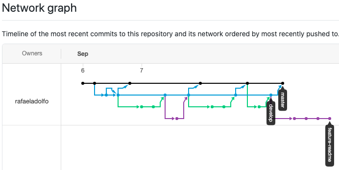
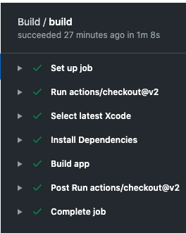

# FastNewsSwiftUI

This repository contains the iOS test source code.

### Stack
* Using SwiftUI 
* MVVM
* Localization

### Features
* Integration with reddit api
* News viewing
* Comments listing
* Url Sharing

###
* Localizable strings for En-US and Pt-BR
* Strings in constant enum to avoid typo's:

```
enum Constants {
    enum String {
        static let loading = NSLocalizedString("Loading", comment: "Message displayed when loading view is presented")
    }
}
```

### Git strategy
* Using gitflow to organize code commits
* Check the flow in network: https://github.com/rafaeladolfo/fastnewsswiftui/network

* Feature branches:
.svg?cdnVersion=1224)

* Release branches:
.svg?cdnVersion=1224)

* Result:  


### Using CICD with github actions
* yml file: https://github.com/rafaeladolfo/fastnewsswiftui/blob/master/.github/workflows/swift.yml
* result:  


